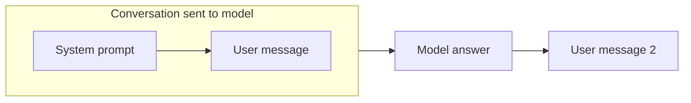
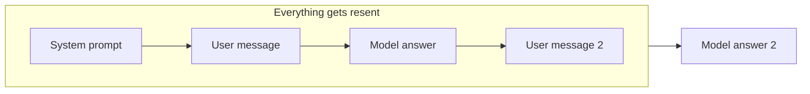

# AI-Driven Development
## Setup & Workflow

---
layout: center
---

# AI is a skill

<v-clicks>

- Skills grow with experience
- Learn to navigate uncertainty
- Tomorrow you know more than today

</v-clicks>

<!--
The point is not to find the one perfect toolchain.
The point is to reduce friction and reduce confusion.
-->

---
layout: center
---

# Invest In The Setup

<v-clicks>

- reduce repeatable manual labor
- enhance AI skills
- build the right prompts/instructions for the task
- use AI to improve your setup

</v-clicks>

---
layout: center
---

# Different Setups (technical)

<v-clicks>

- **Browser chat**: quick, convenient, limited, lot's of copy paste
- **Desktop app**: access to file system (terminal), complex projects possible
- **VPS**: same as desktop, but already "live" on the internet
- **Vibe Coding Platforms**: convenient, powerful but "locked in"

</v-clicks>

---
layout: center
---

# Experiment with different processes

<v-clicks>

- Quick prototyping
- Long setup conversations
- Detailed spec files + automatic execution
- "Human in the loop" at every step
- "AI in the loop", human is the driver

</v-clicks>

> There is no single correct workflow.
> There are workflows that fit different levels of risk, speed, and clarity.

---
layout: center
---

# What Is An LLM Doing?

LLMs predict the next token by considering the previous tokens in context.

<v-clicks>

- Not truth
- Not understanding in a human sense
- Not intention
- Statistical prediction over a context window

</v-clicks>

---
layout: center
---

# Conversation Memory Is Rebuilt Every Turn

---
layout: center
---

# Context Management Is The Core Skill

<v-clicks>

- Prompting is context
- Specs are context
- File structure is context
- Naming is context
- Examples are context
- Tools are context

</v-clicks>

<!--
Move from "prompt engineering" as magic wording toward managing what the model sees,
what it should ignore, and how much ambiguity remains.
-->

---
layout: center
---

# What Are Specs?

<v-clicks>

- A spec reduces ambiguity
- Natural language is inherently ambiguous
- Code is the most specific instruction format we have
- Learn to move towards code and technical

</v-clicks>

---
layout: center
---

# Why Programmers Often Move Faster

<v-clicks>

- They know what level of detail matters
- They can map the problem space
- They notice when something is missing
- They can reduce the fog of war

</v-clicks>

> A living vocabulary matters: frontend, backend, terminal, server, deploy, API.

---
layout: center
---

# The Biggest Problem

You do not know what you do not know.

<v-clicks>

- **Confusion** = not knowing that you "do not know what you do not know"
- **Caution** = knowing that you "do not know what you do not know"
- **Experience** = learning how to navigate anyway

</v-clicks>

---
layout: center
---

# Cognitive Debt Is Real

<v-clicks>

- Fast output can hide weak understanding
- Uncertainty compounds if you ignore it
- Managing uncertainty is a core skill
- If no experienced human is around, ask the model directly about each uncertainty you notice

</v-clicks>

> Replace false certainty with explicit questions.

---
layout: center
---

# Working Principle

<v-clicks>

- Invest in setup
- Be explicit about process
- Treat LLMs as context-sensitive prediction systems
- Use specs to reduce ambiguity
- Turn confusion into caution, then into experience

</v-clicks>
